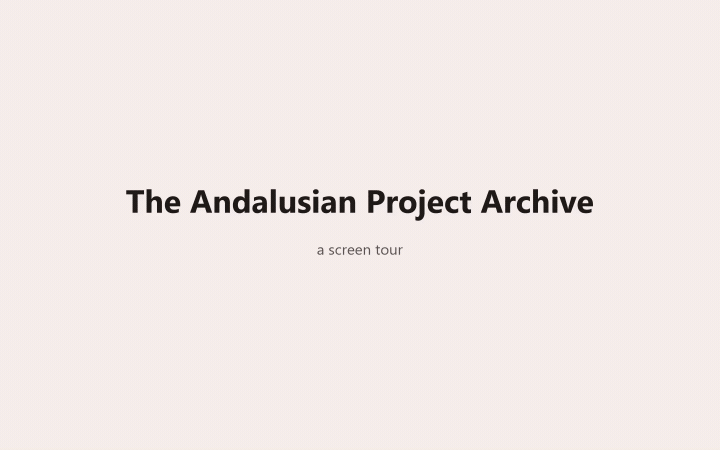

# The Andalusian Project — Asadullah Ali Al-Andalusi: Recovered Works, Papers and Transcripts

A preservation archive of the published work of **Asadullah Ali Al-Andalusi**, founder of
**The Andalusian Project** — an independent Islamic-studies research platform. He has been a
research fellow at the [Yaqeen Institute for Islamic Research](https://yaqeeninstitute.org),
a member of the [Muslim Debate Initiative](https://muslimdebate.org), and a lecturer on
contemporary atheism, philosophy of science, Islamic political thought and information
literacy. Every attested form of his name, where each is attested, and the distinction from the
different and also-active speaker named Abdullah al-Andalusi are on
[`/asadullah-ali-al-andalususi/`](asadullah-ali-al-andalususi.md).

**The original web presence is gone.** `asadullahali.com` is no longer his: the domain resolves
and answers HTTP 200, serving an unrelated slot-gambling operation. Do not use it, and do not
cite it as his site — this archive does not claim to control or represent it, and records the
fact only because a reader searching his name will land there. His WordPress mirror at
`asadullahali.wordpress.com` is still up but its post bodies have been removed: navigable,
described, empty. His YouTube channel returned "This channel is not available." at the live
check recorded on 2026-09-27. All of that is set out, query by query, on
[`/asadullahali-com-what-happened/`](asadullahali-com-what-happened.md) — the page that carries
the safety warning, because a link to that domain would defeat it.

This repository is what is left. It is a preservation archive: works, papers, articles,
notices, link-outs, video records, machine transcripts, capture metadata and image inventories,
recovered from the Wayback Machine, from the Internet Archive, from the Muslim Debate
Initiative's live site and from his own surviving WordPress mirror — **verbatim, with
per-item provenance on every record.** Nothing here is summarised, paraphrased, reworded or
silently merged; where two copies of a work disagree, the archive keeps the longer one, keeps
the other as a recorded alternate, and never adds them together.

---

## Do not contact the author

The author has asked not to be contacted, and he keeps a private life. This is
stated here so that nobody has to guess.

This archive exists so his work can be **used** — read it, cite it, teach from
it, build something good with it. Nothing more is wanted.

Requests to contact him, requests for his personal details, and invitations to
events will not be answered and should not be sent. The maintainers cannot
forward them and cannot put them through.

---

## See it live



The four collections, one work with its provenance, a transcript, the channel
history, the timeline and search — captured from the live site on 2026-09-27, so
it will go stale as the site changes. This is the short preview; the
[full-length version](docs/demo/site-tour.mp4) and the site itself are at
<https://the-andalusian-project-archive.github.io/andalusian-archive/>.

---

## Status

**Recovery run finished 2026-09-27; the corpus is partial, and the gaps are catalogued rather than hidden.** Six recovery lanes ran in parallel — the WordPress
mirror, deleted mirror posts and stub-fills, the Muslim Debate Initiative, best-capture
re-fetches of `asadullahali.com`, secondary sources and academic texts, and the video
catalogue — then an integration pass moved every verified item into the repository, and
independent review checked the result and ordered a fix wave. Two review rounds followed, each
re-running the test suites. The evidence trail — per-lane counts and provenance, an
append-only integration log, both review rounds and the Phase 3 reports — is committed at
[`docs/recovery-log/`](docs/recovery-log/README.md).

The content itself spans 2010-09-20 (the earliest recovered item, a notice) to 2021-09 (the AMJA
conference paper), with the recovered works themselves dated 2011-12-18 to 2020-08-11 and the
papers dated 2014 to 2021. Wayback enumeration reached back to 2007 captures. The recovery date
is 2026-09-27; the content is not from 2026.

**All figures in this README are as of 2026-09-28**, the date the counts were read from
`_data/` after the recount was approved. They are marked at every use so they cannot rot
silently. The site's published headline totals are no longer a separate matter: they were
frozen pending approval of the recount, and the recount has now been applied in one pass, so
this file and the site publish the same set of numbers.

---

## What's inside

Built from the data, not from memory. Every row is a collection in `_data/`, and the count is
the number of rows in it.

| Collection | Count | What is actually held |
|---|---:|---|
| **Recovered works** | **72** | 47 with full text in the repository, 24 catalogued Wayback-only, 1 unrecovered. Dated 2011-12-18 to 2020-08-11. |
| **Video records** | **68** | 56 preserved as files in the Internet Archive's `andalusian-project` collection; 12 catalogued as live re-uploads. 36 mirror URLs attached to the 30 entries they duplicate. |
| **Papers** | **20** | 6 PDF files held locally across 5 of the paper records (one of the six is a Japanese translation of a paper already counted). 2 carry a DOI on the paper record. |
| **Machine transcripts** | **68** | 540,995 words and 37,388 paragraphs, published one document per capture. 57 attached to a video record, 11 preserved but deliberately not attached. Three documents carry a redaction applied at publication time, which is why the word total is 48 higher than the raw captures' own count (see [`NOTICE.md`](NOTICE.md) §6.2). |
| **MDI articles** | **17 rows / 4 items** | Full text of all 17 held verbatim, 24,081 words. 13 of the 17 are a second publication of a work already counted, decided by 5-gram text comparison rather than title similarity. |
| **Notices** | **3** | Announcements that are not works (a book list, a library update, a link post). Catalogued, never counted. |
| **Link-outs** | **10** | The conversion-story reprint (held as metadata only; its body was never fetched) and 9 Yaqeen pages (link-outs by policy; their text is never downloaded). |
| **Secondary-source records** | **70** | Mentions, bios, reprints and critiques written by other people about him. 33 mentions, 27 bios, 8 reprints, 2 critiques. None is counted as content. |
| **Recovered images** | **334** | Images referenced by the WordPress mirror: 40 PNG, 294 JPG. The mirror delivered 335 staged files totalling **70,818,428 bytes** — the 335th is one PDF — which deduplicate to 286 unique files at 64,283,508 bytes. A further 3 URLs were third-party CDN references and are unrecoverable. |
| **Wayback capture records** | **87** | One record per CDX capture: 17 actual-post permalinks, 13 monthly archives, 10 feeds, 2 AMP pages, 45 query variants. 51 fetched, 36 recorded as holding no content. |
| **Channel timeline** | **26 rows** | Capture-dated states of the YouTube channel, plus an 18-point subscriber series read from the channel's own header. |
| **Works recovery log** | **74 rows** | Per-work verdicts from the re-fetch lanes, with the method and word count for each. |

Additional rows that exist but are never counted, because counting them would count the
archive against itself: 9 Yaqeen link-out rows, 33 Al Balagh Academy course rows (3 of them
taught by him), 1 external Q&A interview, 12 superseded video duplicates preserved in full,
and 74 recovery-log rows.

The built site is 321 HTML pages plus 6 PDFs, with a 319-entry sitemap. The two built pages that
are deliberately absent from the sitemap are `404.html` and `/search/`, which is `noindex` because
it is an application surface rather than a page. All 319 sitemap `<loc>` values are absolute and
resolve to a file on disk.

---

## Lost and found

This is what the recovery actually changed. The figures come from the lane manifests and the
integration log, both committed under `docs/recovery-log/`.

| What was missing or degraded | What it is now |
|---|---|
| **22 permalinks the WordPress mirror no longer returns.** A fresh CDX enumeration found 42 post permalinks with a 200 capture; 20 were still in the mirror's API, 22 were gone, holding 110 available captures between them. | **18 recovered as items the archive did not have — 15 works plus 3 announcements**, catalogued as notices rather than works. 2 more filled stubs on works already held. 5 verified against captures already recorded. 0 not found. 31,631 words of prose, 78 Wayback fetches, every one HTTP 200. |
| **"The Inhumanity of Human Rights" was listed as lost.** | **Found**, at 629 words. 22 of its 65 available captures were fetched and every one returns the same 629 words ending "-To be continued-". No Part 2 exists in any capture, so the work is recorded as found and incomplete. |
| **"Library Take Down Notice" was held as a 45-word stub.** | **Found**, at 216 words. |
| **"Reviewing HaqiqatJou" was held at 54,296 words — an earlier, shorter capture of a work that runs to nearly 69,000 words.** | **68,903 words**, +14,607, adopted from the WordPress mirror's own copy (last modified 2021-07-14). Diffed against the `asadullahali.com` capture and adopted as the single best text, never summed. This was the largest single gain in the recovery. |
| **8 other works whose fullest Wayback capture beat the copy the archive held.** | 8 fuller versions adopted, each diffed and each recorded as one text rather than a sum, gaining between **50 and 366** words each. |
| **17 Muslim Debate Initiative articles existed only as live pages.** | Full text recovered verbatim on 2026-09-27, 24,081 words, all 17 held three ways (extracted prose, JSON cross-check, raw source) with the cross-check matching exactly. |
| **A channel that now returns "This channel is not available."** | 68 catalogued videos with their IDs, durations, byte sizes and archive URLs. 56 preserved as files in the Internet Archive's `andalusian-project` collection; 12 catalogued as live re-uploads with a named uploader; 36 mirror URLs attached to the 30 entries they duplicate; 12 removed duplicates preserved in full in a superseded-video ledger rather than deleted. |
| **The channel's own history — which was being described incorrectly.** | A 26-row capture-dated timeline, an 18-point subscriber series read from the channel's own header (190 in 2015 rising to 15.7K in 2022), the channel-id continuity argument, and **three claims this archive refuses to make, each recorded with the evidence that rejects it.** |
| **20 papers, most with no local copy.** | 6 PDF files held locally across 5 of the paper records, and served from the site; a 24-row access ledger recording 8 open-access, 15 restricted and 1 dead item, so the gap is visible rather than implied; 5 DOIs recorded, including one that is dead and is recorded as dead. Three of the held PDFs carry an explicit byte-identity proof: one sha256 against the publisher's own file as captured by the Internet Archive, one sha256 against the university repository bitstream, and one against the archive's own earlier copy of the same file. |
| **Nothing at all — no text of any of the lectures.** | **68 published machine transcripts, 540,995 words**, one document per capture, each with its capture file, cue count, language and producing model. |
| **334 images referenced by the mirror, none recovered.** | 334 retrieved and inventoried. The mirror delivered 335 staged files totalling 70,818,428 bytes, which deduplicate to 286 unique files at 64,283,508 bytes. See [Note on the recovered images](#note-on-the-recovered-images) for their publication status. |

The theme running through all of it: **this material was not lost, it was scattered and
unlinked.** The best copies of this work sit across Wayback replay URLs, an Internet Archive
directory listing, a live third-party site and a WordPress shell with no bodies. What did not
exist was a single citable place, and that is what this repository is.

---

## Cite this archive

The archive asks to be cited as a *preserved copy* with its provenance, not as a replacement
for the publisher. Every page carries the fields below in its own front matter, so a citation
can be built from the page itself.

**A work.** Where the original host is gone, cite the archive's copy and name the capture.

```
Asadullah Ali Al-Andalusi, "<title>", <date>. The Andalusian Project.
Preserved in The Andalusian Project Archive,
https://the-andalusian-project-archive.github.io/andalusian-archive/articles/<slug>/;
original capture: <wayback_url>.
```

**A paper.** Cite the publication first; the archive is the surviving copy.

```
Asadullah Ali Al-Andalusi. "<title>." <publisher_journal> <volume_issue> (<year>).
DOI <doi>. Preserved copy:
https://the-andalusian-project-archive.github.io/andalusian-archive/papers/<file>.pdf
(<N> pp.), obtained from <file_source>.
```

Worked examples from the data, both of which have a dead or restricted primary source:

- *The Rise and Decline of Scientific Productivity in the Muslim World: A Preliminary Analysis*,
  ICR Journal 6(2):229–246 (2015). DOI `10.52282/icr.v6i2.333` — **dead**; the hostname
  `icrjournal.org` no longer resolves. The archive holds the 18-page publisher PDF, taken from
  the Internet Archive capture of the publisher's own file (`admin-ar-6.pdf`) and
  sha256 byte-identical to it. The article is also registered as `10.12816/0019168`, whose
  Kezana.ai landing page reports `IsOpenAccess=false`.
- *Understanding Aisha's Age: An Interdisciplinary Approach*, with Dr Jonathan Brown, Yaqeen
  Institute (2018). DOI `10.65061/HDXB1161`. Yaqeen remains the canonical publisher; this
  archive does not mirror it.

**A transcript.** Always carry the disclaimer with it. The sentence is reproduced verbatim from
`_data/transcript_index.json` and is printed on all 68 transcript pages:

> Transcript by machine — accuracy isn't perfect, so it shouldn't be used in polemics or debate material as an authoritative source.

```
Asadullah Ali Al-Andalusi, "<title>", <date>, video (<video id>).
Machine transcript (<N> words), The Andalusian Project Archive,
https://the-andalusian-project-archive.github.io/andalusian-archive/transcripts/<id>/.
Transcript by machine — accuracy isn't perfect, so it shouldn't be used in polemics or
debate material as an authoritative source.
```

Two of the archive's own recording conventions are worth knowing before you cite a transcript:
a re-upload of the same recording is an *additional transcript of the same recording*, not a
second work, and is not counted again; and where a transcript is preserved but deliberately not
attached to its catalogue entry, the page says so rather than leaving the absence to be
inferred.

---

## Rights and ethics

Four positions, stated in full in [`LICENSE`](LICENSE) and [`NOTICE.md`](NOTICE.md):

- **The author's works are not relicensed here.** They are reproduced verbatim with attribution
  to Asadullah Ali Al-Andalusi. Copyright in them is unchanged; nothing in this repository
  grants a licence to them.
- **The archive's own work is CC BY-NC 4.0.** The data files, the scripts that build and check
  the site, and the documentation — including this README — are yours to reuse non-commercially,
  with attribution.
- **Some items are withheld, and [`NOTICE.md`](NOTICE.md) lists every one of them.** Personal
  names withheld at the site owner's request, with every one of them disclosed in `NOTICE.md`
  §6.1 rather than left as a silent gap; raw capture files and staging artefacts
  kept out of the repository; and two PDFs — a book chapter and a Japanese translation — held
  with their public provenance recorded as unverified, published because the files are genuine
  and in hand but not attributed to a source the archive can confirm. One held PDF's embedded
  metadata carried a personal identifier and was cleared field by field, leaving its 63 pages
  byte-identical (`NOTICE.md` §6.4).
- **This is a dated polemical archive.** It preserves arguments that were published in a
  particular context, against particular interlocutors, at a particular time. The claims are
  the author's, not the archive's, and the archive takes no position on them.

Three further things the archive did not do, recorded because they matter: it did not fight the
Cloudflare challenge that blocks Academia.edu; it did not download any PDF that a publisher's
own terms place behind an access control; and it contacted the live `asadullahali.com` zero
times, because that domain is no longer the author's.

It forwards nothing either. Requests to contact the author, requests for his personal details
and invitations to events are not passed on, and the maintainers have no way to put them
through. See the notice at the top of this file and [`NOTICE.md`](NOTICE.md) §10.

---

## Topics covered

A map of the substantive ground this corpus covers, for a reader looking for a subject rather
than a title.

**Islam and contemporary atheism.** The largest single body of work: the six-session
*Understanding Atheism* lecture series, *Deconstructing Contemporary Atheist Thought* (AMJA,
2021), the *Rationality of Believing in God Without Evidence* pair, *Atheism: Doubting Your
Doubts*, and the iJihad episode run responding to The Masked Arab. The series argues in
explicitly labelled steps — the transcripts carry `P1`, `P2`, `P3` and a conclusion marker
through the argument — and all six session transcripts are published here.

**The Qur'an and 86:5–7.** *Between a Backbone and Ribs: An Analysis of Al-Quran 86:5-7* (63 pp.,
the author's own CC-licensed deposit on the Internet Archive) is the archive's most closely-read
scholarly text, and the longest work it holds at 20,037 recovered words under its companion
blog record. It is a tafsir-critical study of one contested verse rather than a polemic on it.
The paper is served as a PDF from this site; the blog record is the same argument with the
surrounding discussion.

**Islamic intuitionism and evidentialism.** *Islamic Intuitionism: The Case Against Atheistic
Evidentialism* — his 2014 IIUM master's thesis, filed under a name the site owner has asked not
to be published here and which is shown as `[real name withheld]` throughout. The archive holds
the open 24-page repository excerpt, sha256 byte-verified; the 86-leaf original is restricted by
the university and is not claimed here. The author line of the institutional record is public
there and is left unchanged there, so the citation still resolves — see
[`NOTICE.md`](NOTICE.md) §6.1.

**Aisha's age, and moral judgment of the past.** *Religion vs Paedophilia* (2013, three parts)
and its successor *Understanding Aisha's Age* (2018, with Dr Jonathan Brown). The 2013 trilogy
introduces "normative circumstantial morality" and "moral progressionism" in Part 2 — his own
coinages, and the terms the trilogy is cited for.

**Science, scientism, and the historiography of decline.** *The Rise and Decline of Scientific
Productivity in the Muslim World* (2015), its successor *The Structure of Scientific
Productivity in Islamic Civilization: Orientalists' Fables* (2017), *From Science to Scientism*,
*A Muslim's Guide to Science: Scientism*, *The Qur'an and Science: A Forced Marriage*, and the
*classical narrative* as he uses the phrase.

**Information literacy.** His professional lane rather than a polemical one, and the one part
of the corpus with a library-science rather than a theological subject: *Lesson One [Full
Lecture] | Information Literacy*, and *Librarianship and Information Literacy | Interview with
Justin Parrott*. Both recordings and their transcripts are preserved here. Not to be confused
with Justin Parrott's separate Yaqeen paper of a similar title, which is a different author's
work and is a link-out in this archive.

**Liberalism in Muslim thought.** *Still Colonized? Liberalism in Muslim Thought* — which
survives as a talk record, a body-less WordPress mirror URL and a short Muslim Debate
Initiative notice, with the argument itself in a recording — plus *Decoding Contemporary
Liberalism*, the "empowerment versus disenfranchisement" framing, and the *Al Balagh* course
*Decoding Liberalism, Feminism & Secularism*.

**Terrorism, extremism, and Islamophobia.** *Who Justifies Terrorism*, *Islam and Terrorism*,
*Extremism in Muslim Thought*, *Boko Haram and the Culture of Coercive Disapproval*, and
*Whataboutery: The Fail-Safe of Islamophobes*.

**Apologetics as a method.** *Extraordinary Claims Require Extraordinary Evidence Says
Ordinary Intellect*, *The 3 Isms of Atheism*, *Towards Litter Reduction: A Maqasidi Approach*,
*The Archetype of Beauty in Islam*, and *Hard Questions: Answering Doubts About Islam*.

**The Muslim Debate Initiative debates.** All 17 author-archive articles, including the
*Understanding Atheism* series index, the iJihad and iKhalifa episode guides, the
*Still Colonised* notice, and the three-part *Religion vs Paedophilia* run.

**The Al Balagh lecture courses.** 33 catalogued, of which 3 he taught: *Atheism and Islam –
Level 1*, *Decoding Liberalism, Feminism & Secularism*, and *Confronting Islamophobia: A Critical
Analysis*.

**Feminism, gender, and the family.** *Do Muslim Women Need Feminism?*, *How Feminism Undermines
Islam and Gender Justice*, *Gender Equality, Islam, and Law* (with Raihanah Abdullah), and the
Marina Mahathir exchange.

**Personal and biographical.** *My Conversion Story* — Catholicism, atheism, the Orthodox
Church, Islam — preserved as a recording, with the third-party reprint of that account held as
a link-out whose body this project deliberately never fetched. The birth name he discusses in
that account, and the thesis-era name in the item above, are both withheld here at the site
owner's request; on the three published transcript pages the birth name is marked
`‖ birth name withheld ‖` in place. See [`NOTICE.md`](NOTICE.md) §6.1.

---

## Site

**https://the-andalusian-project-archive.github.io/andalusian-archive/**

This repository is the source of that site. Jekyll builds it and GitHub Actions deploys it; the
generated `data/*.json` search indexes are produced from `_data/` by
`scripts/sync_search_data.py` on every build and must never be hand-edited.

---

## Contents and structure

```
_data/            canonical source of truth. Every collection, every count, every
                  provenance field. 23 JSON files; nothing on the site types a number
                  that is not counted from here. `entity_page.json` holds the attested
                  name forms, roles and external attestations behind the entity page;
                  `series.json` is generated by `scripts/build_series_index.py`.
_posts/           54 dated post files, the older of the two prose collections
_articles/        92 pages: the remaining works, the 17 MDI articles, and the 3 notices
_papers/          20 paper pages, with 6 PDFs in _papers/pdfs/
_videos/          68 video records
_transcripts/     68 published machine transcripts
_layouts/         6 Jekyll layouts
_includes/        shared partials
assets/           stylesheet
scripts/          build and test tooling: collection builders, taxonomy applier,
                  series-index builder, search-data sync, fetchers, transcribers,
                  and four test suites
data/             generated search indexes. Never hand-edit; built from _data/
docs/             recovery-log/ — the committed evidence trail
docs/demo/        the site tour: a screen recording of the live site, and its
                  provenance. Recorded 2026-09-27; re-record when the site changes
docs/superpowers/ the plan this recovery was executed against
.github/          the Pages deploy workflow
_staging/         raw captures and binaries. Gitignored, deliberately not published
_config.yml       Jekyll configuration
index.md articles.md papers.md videos.md transcripts.md
channel.md timeline.md search.md   site pages
series/           the 7 transcript series pages (one file per series, each a
                  thin wrapper around _includes/series_page.html)
asadullah-ali-al-andalususi.md     the entity page: who the subject is
asadullahali-com-what-happened.md  the lost-and-found page: what happened to the
                                  site, the mirror, the channel and the domain
transcripts/by-series.md           the series index
```

### The three searchability surfaces (added 2026-09-28)

Three pages were added because the queries people actually type about this corpus had no
honest answer anywhere on the web. None of them changed a published figure, and each
reads its facts and counts out of `_data/` at build time.

| Page | Route | What it answers |
|---|---|---|
| Who this is | `/asadullah-ali-al-andalususi/` | Every attested form of his name and where each is attested; the distinction from the different, active speaker also called Abdullah al-Andalusi, with the byline gate that keeps their work apart; his four recorded roles with the corpus's own tense preserved; a linked index into the collections; the loss record; and what this archive is and is not. Emits `Person` + `BreadcrumbList` JSON-LD. |
| What happened to the website | `/asadullahali-com-what-happened/` | `asadullahali.com`, the WordPress mirror, the YouTube channel and the dead publisher domain. Carries the safety warning that the domain is now an unrelated gambling site — printed as plain text, never as a link — and answers the seven queries the archive is the only page answering. Emits `Article` + `FAQPage` + `BreadcrumbList` JSON-LD. |
| Transcripts by series | `/transcripts/by-series/` and 7 series pages | The 68 transcripts were one flat list, so a reader wanting session three of a series had nothing to land on. Grouped into the series the channel itself numbered, with each part's transcript linked directly. |

The grouping signal is the channel's own `NN - <series name>` title shape, **not** the
`themes`/`topics`/`tone` fields on the video rows: those are produced by a first-match-wins
substring classifier (`scripts/generate_video_themes.py`) whose largest bucket is its
`default` branch, so they relabel rows rather than group them, and no per-transcript topic
field exists at all. 28 recordings group into 7 series; the other 40 are not filed under an
invented category and the index says so with that count. The rule lives in
`scripts/build_series_index.py` and is re-derivable with `--check`.

---

## Note on the recovered images

334 images were recovered and inventoried. They are **staged but not published**: they sit
under the gitignored `_staging/` tree, and the live site currently renders a small number of
Wayback replay hotlinks instead. The count above is therefore an inventory of what was
recovered, not a claim about what the site serves. This is stated here rather than left for a
reader to discover.

## Note on the published totals

**The recount is approved and applied.** This section used to explain that the counts in this
README were correct while the site's own headline totals were still frozen at their pre-recount
values, and that the two would not match until the site owner approved the recount. That is no
longer the state of the project.

On 2026-09-28 the approval was given and the recount was applied in one pass, so this file and the
site publish one set of numbers: 72 works (47 full-text, 24 Wayback-only, 1 lost), 68 videos, 20
papers, 17 MDI rows of which 4 are counted, 3 announcements never counted, 70 third-party source
records never counted, and a total of 207 that is a sum rather than a figure anyone typed.

**The published total is now computed, not typed.** The site's headline panel reads its seven terms
out of `_data/` in a Liquid loop and prints the arithmetic it performed:

```
Total 207 = 72 + 68 + 20 + 4 + 9 + 33 + 1
```

Every page that shows a count — the homepage, the works index, the papers index, the search page
and the timeline — counts it from `_data/` at build time, and
`scripts/test_canonical_57.py` recomputes the same total from the same files and fails if
`_data/content_index.json` disagrees with either the data or its own published formula string.

The history of the gate is worth keeping, because it is why the pass took this shape. Phase 3
published the recount on the works and papers pages while the homepage still published the old
figures; the independent review caught that as a Critical finding and the fix wave reversed it, so
the site spent a day contradicting itself rather than contradicting the data. The gate existed so
the owner would see one diff. It is now closed, and closed the only way that keeps working: by
making the numbers impossible to type.

---

*Figures as of 2026-09-28. Recovery method, per-lane counts, integration log and review
rounds: [`docs/recovery-log/`](docs/recovery-log/README.md).*
